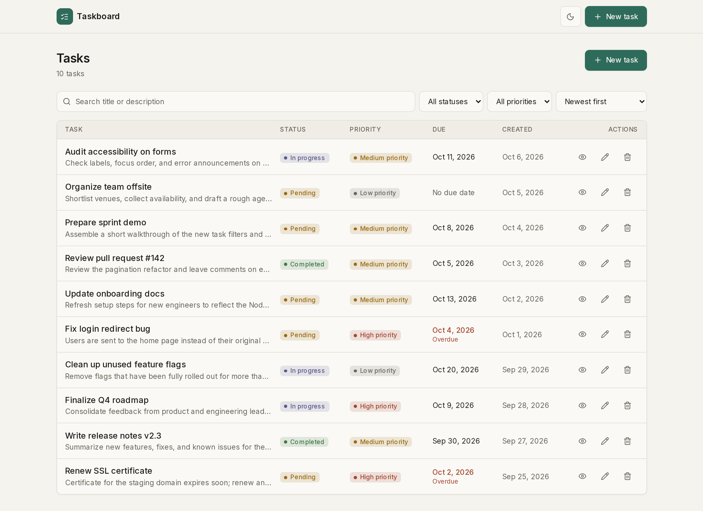
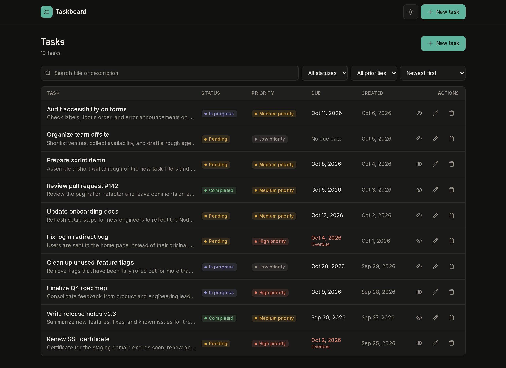
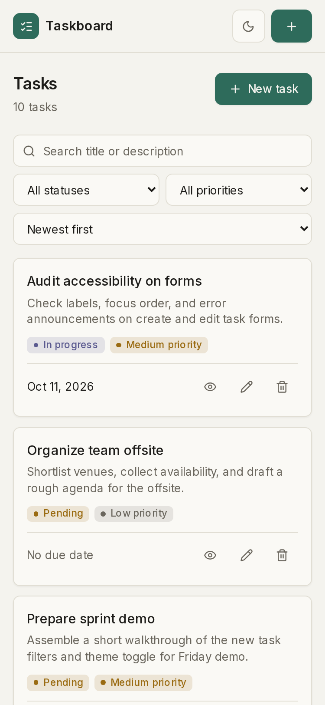
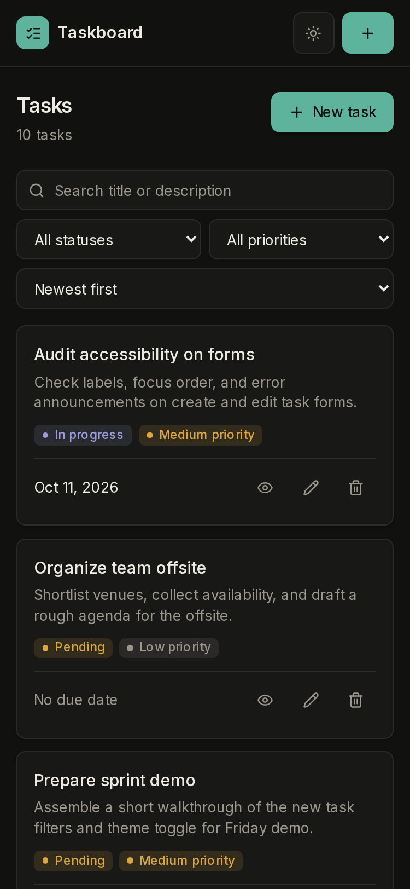
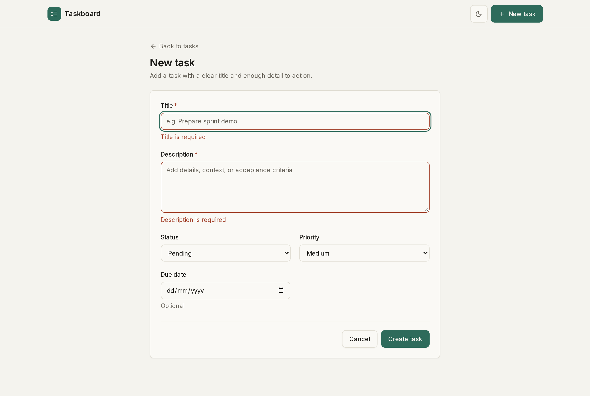
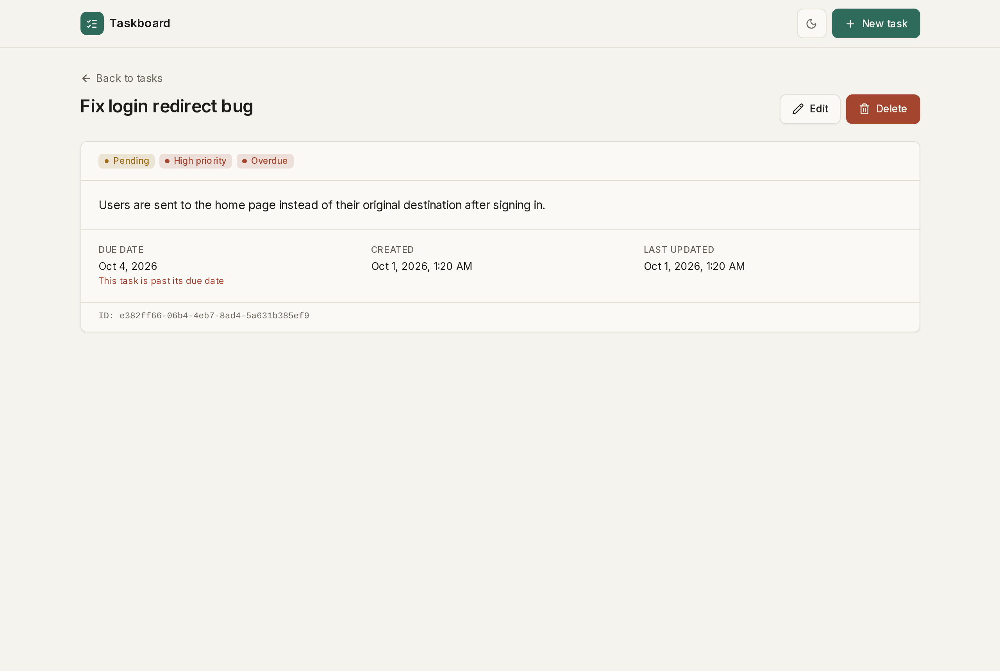
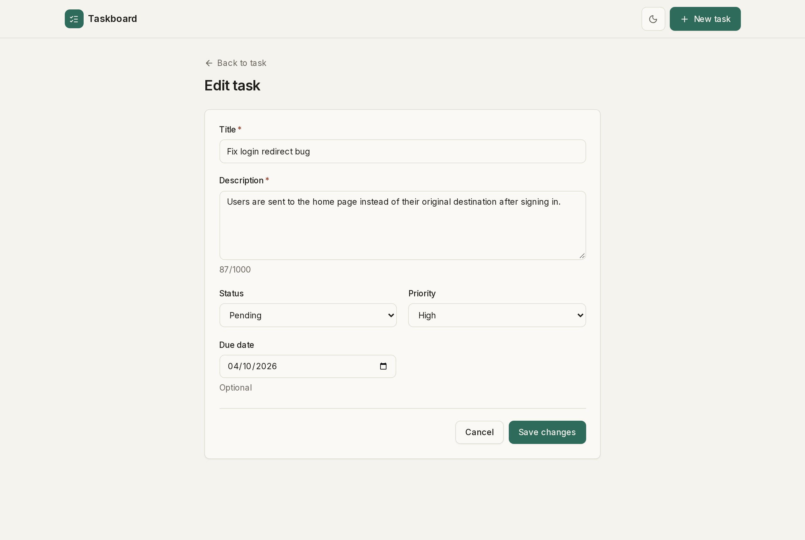
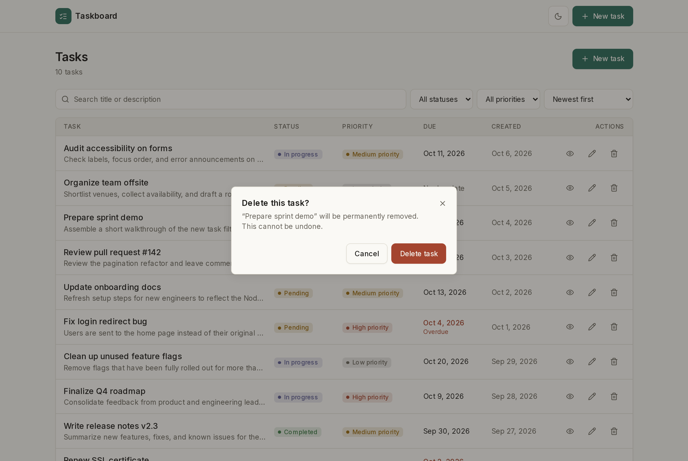
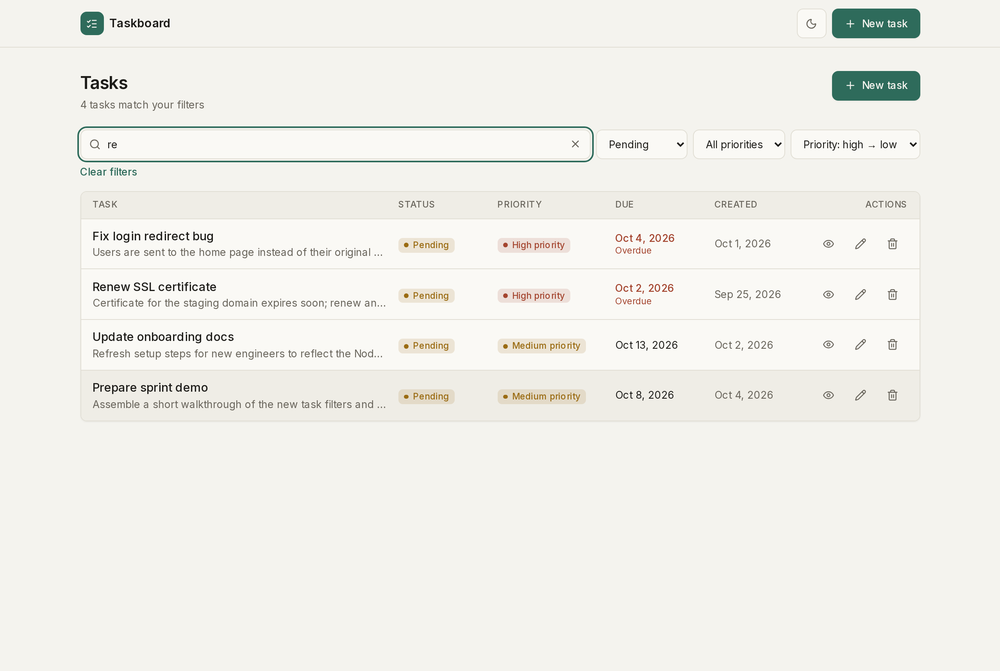
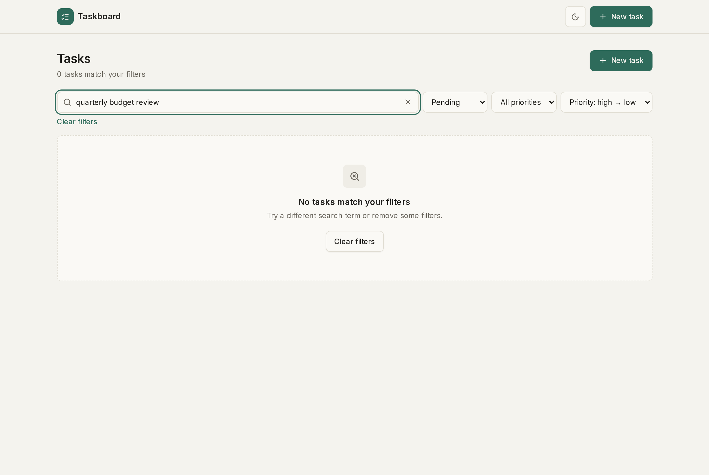

# Taskboard — Task Management System

A full-stack task manager: a **Next.js + Tailwind CSS** frontend talking to a **Node.js/Express** REST API. Create, view, edit and delete tasks, with search, filters, sorting, pagination and a light/dark theme.

## Features

**Core**
- Dashboard listing all tasks with status and priority badges, due date (overdue highlighted) and created date
- Create and edit tasks with client-side + server-side validation and inline field errors
- Task details page with full description, timestamps and actions
- Delete with a confirmation dialog
- Loading skeletons, empty states, error states with retry, and success/error toasts on every view
- Responsive: table-style rows on desktop, stacked cards on mobile

**Bonus**
- Debounced search (title + description), status and priority filters, six sort options
- Pagination with page-size selector (10 / 20 / 50)
- Filters, sort and page are kept in the URL, so refresh, back/forward and shared links preserve the view
- Light/dark theme following the OS by default, persisted, no flash on load
- Swagger UI, OpenAPI spec and a Postman collection

## Screenshots

| Light | Dark |
|---|---|
|  |  |

| Mobile — light | Mobile — dark |
|---|---|
|  |  |

**Create task — validation**


**Task details**


**Edit task**


**Delete confirmation**


**Search, filter and sort**


**No results**


## Tech stack

| Layer | Tools |
|---|---|
| Frontend | Next.js 16 (App Router), React 19, Tailwind CSS v4, lucide-react, Inter via `next/font` |
| Backend | Node.js 20+, Express 5, zod (validation), cors, dotenv, swagger-ui-express + yamljs |
| Storage | In-memory array (no database) |
| Tooling | vitest + supertest (API tests), Playwright (screenshots), ESLint |

## Architecture

```
Browser
  │  Next.js pages (Client Components)
  │    └─ components/  ── presentational, props-driven
  │    └─ hooks/       ── useTasks, useTask, useTaskQuery (URL state), useDebounce, useTheme
  │    └─ api/         ── the only place HTTP happens (fetch wrapper + task endpoints)
  ▼
Express API  (/api)
  routes/       → URL + validation middleware (zod)
  controllers/  → HTTP only: read request, send response
  services/     → business logic + the in-memory task store
  middleware/   → validate, notFound, central errorHandler
  utils/        → AppError, seed data
```

Errors are thrown as `AppError` and turned into a consistent JSON shape by one error handler.

## Folder structure

```
.
├── backend/
│   ├── .env.example
│   └── src/
│       ├── app.js · server.js
│       ├── config/env.js
│       ├── routes/ · controllers/ · services/ · validators/
│       ├── middleware/{validate,notFound,errorHandler}.js
│       └── utils/{AppError,seed}.js
├── frontend/
│   ├── .env.example
│   └── src/
│       ├── app/            # layout, dashboard, tasks/new, tasks/[id], tasks/[id]/edit, not-found
│       ├── api/            # client.js, tasks.js
│       ├── components/     # Button, Field, Badge, Modal, Toast, TaskForm, TaskList, TaskFilters, Pagination, …
│       ├── hooks/
│       └── utils/          # format.js, validate.js
└── docs/
    ├── openapi.yaml
    ├── task-manager.postman_collection.json
    └── screenshots/
```

## Getting started

**Prerequisites:** Node.js 20+ and npm.

### 1. Backend (port 5000)

```bash
cd backend
cp .env.example .env
npm install
npm run dev        # or: npm start
```

The API starts with 10 sample tasks.

### 2. Frontend (port 3000)

```bash
cd frontend
cp .env.example .env.local
npm install
npm run dev        # production: npm run build && npm start
```

Open http://localhost:3000.

### Environment variables

| App | Variable | Default | Purpose |
|---|---|---|---|
| backend | `PORT` | `5000` | API port |
| backend | `CORS_ORIGIN` | `http://localhost:3000` | Allowed browser origin |
| backend | `NODE_ENV` | `development` | `test` skips seeding; stack traces in 500 responses only in `development` |
| frontend | `NEXT_PUBLIC_API_URL` | `http://localhost:5000/api` | Base URL of the API |

## API

Base URL: `http://localhost:5000/api`

| Method | Path | Success | Errors |
|---|---|---|---|
| GET | `/tasks` | 200 `{ data, meta }` | 400 (invalid query) |
| GET | `/tasks/:id` | 200 `{ data }` | 404 |
| POST | `/tasks` | 201 `{ data }` | 400 |
| PUT | `/tasks/:id` | 200 `{ data }` | 400, 404 |
| DELETE | `/tasks/:id` | 200 `{ message }` | 404 |
| GET | `/health` (no `/api` prefix) | 200 | |

**List query parameters:** `search`, `status` (`pending`/`in_progress`/`completed`), `priority` (`low`/`medium`/`high`), `sortBy` (`createdAt`/`priority`/`dueDate`), `order` (`asc`/`desc`), `page` (≥1), `limit` (1–50). Empty values are ignored; tasks without a due date always sort last.

**Validation:** `title` (1–120 chars) and `description` (1–1000 chars) are required and trimmed; `status` defaults to `pending`, `priority` to `medium`; `dueDate` is optional and must be a real `YYYY-MM-DD` date. `PUT` replaces the whole task.

### Example

```http
POST /api/tasks
Content-Type: application/json

{
  "title": "Finish assignment",
  "description": "Complete the full-stack task manager",
  "status": "pending",
  "priority": "high",
  "dueDate": "2026-10-05"
}
```

```json
201 Created
{
  "data": {
    "id": "3f2b8c1e-6a4d-4e2f-9b7a-1c5d8e9f0a12",
    "title": "Finish assignment",
    "description": "Complete the full-stack task manager",
    "status": "pending",
    "priority": "high",
    "dueDate": "2026-10-05",
    "createdAt": "2026-10-01T09:30:00.000Z",
    "updatedAt": "2026-10-01T09:30:00.000Z"
  }
}
```

```http
GET /api/tasks?search=report&status=pending&sortBy=dueDate&order=asc&page=1&limit=10
```

```json
{ "data": [ … ], "meta": { "page": 1, "limit": 10, "total": 1, "totalPages": 1 } }
```

### Error format

Every error uses the same shape:

```json
400 Bad Request
{
  "error": {
    "message": "Validation failed",
    "details": [
      { "field": "title", "message": "title is required" },
      { "field": "dueDate", "message": "dueDate must be a valid calendar date" }
    ]
  }
}
```

```json
404 Not Found
{ "error": { "message": "Task not found" } }
```

Malformed JSON returns 400 and unknown routes return 404, both in this shape. Unexpected failures return a generic 500 message.

### API docs

- **Swagger UI:** http://localhost:5000/api-docs (served from [`docs/openapi.yaml`](docs/openapi.yaml))
- **Postman:** import [`docs/task-manager.postman_collection.json`](docs/task-manager.postman_collection.json). It uses a `{{baseUrl}}` variable (default `http://localhost:5000/api`). Running it in order creates, reads, updates and deletes a task, with status-code tests on every request.

## Design notes

- Flat, quiet UI: off-white and dark-ink palettes, 1px borders, very soft shadows, 8px radius, no gradients, no pure white or black.
- All colors are CSS variables mapped into Tailwind (`bg-surface`, `text-muted`, `bg-accent`, …), so components look right in both themes without `dark:` overrides.
- Status badges: pending = amber, in progress = indigo, completed = green. Priority: low = grey, medium = amber, high = red.
- The theme is set by an inline script before first paint (no flash), defaults to the OS preference, and is saved in `localStorage`.
- Accessible by default: labelled controls, `aria-invalid` field errors, visible focus rings, 40px touch targets, focus-trapped dialogs with Esc to close, live-region toasts, reduced-motion support.

## Tests

Tests live in `/test`, which has its own `package.json` and is **gitignored** (kept locally, not part of the submission).

```bash
cd test
npm install
npx playwright install chromium
npm test           # API tests (vitest + supertest) — imports the Express app directly, no server needed
npm run shots      # regenerates docs/screenshots/* (reuses servers on :5000/:3000, or starts them)
```

The API suite covers create (201/400, malformed JSON), list (defaults, search, filters, sorting, pagination, invalid query), get (200/404), update (200/400/404), delete (200/404), unknown routes and `/health`.

## Assumptions

- Data is stored in memory, so it **resets every time the backend restarts**. The backend re-seeds 10 sample tasks on start unless `NODE_ENV=test`.
- There is no authentication; this is a single-user tool.
- "Overdue" means the due date is before today (local time) and the task is not completed.
- Dates are stored as plain `YYYY-MM-DD` strings without a time zone.
